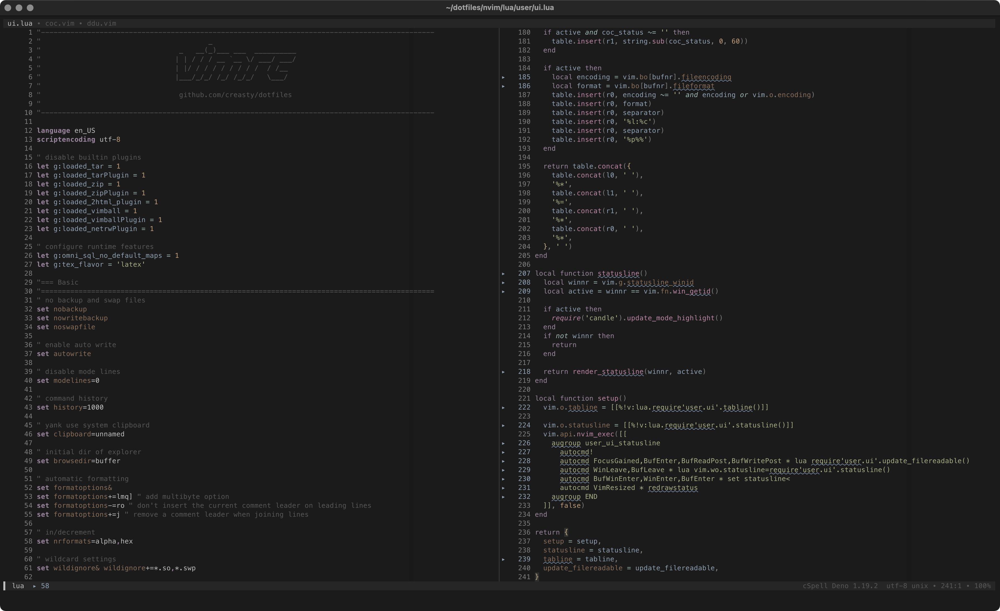

dotfiles [](https://github.com/creasty/dotfiles/actions/workflows/provisioning.yml)  [](./LICENSE.txt)
========

Where the world revolves around.<br>
Work it harder, make it better, do it faster, makes us stronger.

<pre><code>$ curl -L <a href="http://dotfiles.creasty.com/up">dotfiles.creasty.com/up</a> | bash</code></pre>

Screenshots
-----------

| Tmux + ZSH (Alacritty) | Neovim (Kitty) |
|---|---|
|  |  |

Stats
-----

Heavily customized while meticulously optimized for high performance.

### zsh

- ~150ms to startup
- 560 loc of config
- 2 zsh plugins + anyenv (rbenv, nodenv, jenv) + direnv

<details>

```sh-session
$ repeat 5 ( time zsh -i -c exit ; sleep 0.1 )
zsh -i -c exit  0.08s user 0.07s system 96% cpu 0.148 total
zsh -i -c exit  0.08s user 0.07s system 96% cpu 0.151 total
zsh -i -c exit  0.08s user 0.06s system 95% cpu 0.145 total
zsh -i -c exit  0.08s user 0.06s system 94% cpu 0.148 total
zsh -i -c exit  0.08s user 0.06s system 94% cpu 0.148 total
```

```sh-session
$ cloc --exclude-dir=plugins shell/zsh
       6 text files.
       6 unique files.
       4 files ignored.

github.com/AlDanial/cloc v 1.84  T=0.01 s (296.9 files/s, 57072.9 lines/s)
-------------------------------------------------------------------------------
Language                     files          blank        comment           code
-------------------------------------------------------------------------------
zsh                              4            126             81            562
-------------------------------------------------------------------------------
SUM:                             4            126             81            562
-------------------------------------------------------------------------------
```

```sh-session
$ ls shell/zsh/plugins | wc -l
```

Profiling:

```sh-session
$ ZSH_PROF_ENABLED=1 zsh -i -c exit
```

</details>

### nvim

- ~140ms to startup
- 3,700 loc of config
- 36 third-party plugins

<details>

```sh-session
$ repeat 5 ( time nvim --headless -c quit ; sleep 0.1 )
nvim --headless -c quit  0.11s user 0.08s system 147% cpu 0.129 total
nvim --headless -c quit  0.12s user 0.08s system 147% cpu 0.135 total
nvim --headless -c quit  0.12s user 0.08s system 146% cpu 0.134 total
nvim --headless -c quit  0.12s user 0.08s system 146% cpu 0.138 total
nvim --headless -c quit  0.12s user 0.08s system 144% cpu 0.135 total
```

```sh-session
$ cloc --exclude-dir=dein,template nvim
      96 text files.
      92 unique files.
      35 files ignored.

github.com/AlDanial/cloc v 1.84  T=0.08 s (780.8 files/s, 56028.0 lines/s)
-------------------------------------------------------------------------------
Language                     files          blank        comment           code
-------------------------------------------------------------------------------
vim script                      52            457            307           2236
Lua                              7             88             21            734
JSON                             1             14              0            292
TOML                             3             44             14            262
Python                           2             36              2            192
Scheme                           1              4              5             28
-------------------------------------------------------------------------------
SUM:                            66            643            349           3744
-------------------------------------------------------------------------------
```

```sh-session
$ rg '^\[\[plugins' nvim/dein.toml nvim/dein_lazy.toml | wc -l
```

Profiling:

```sh-session
$ nvim --headless --startuptime /dev/stdout -c quit
```

</details>

Author
------

Yuki Iwanaga ([@creasty](https://github.com/creasty))
