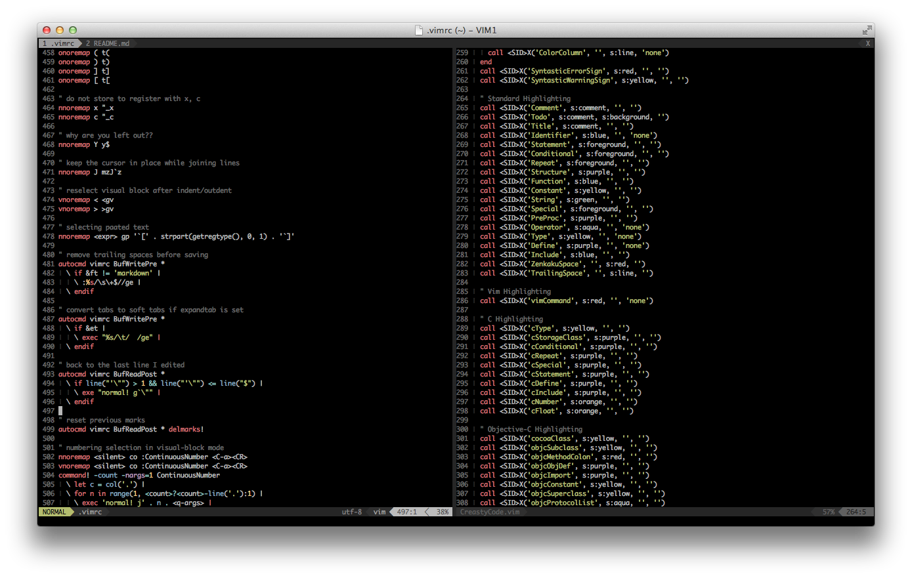

dotfiles
========

Home sweet home


Bootstrap
---------

```sh
$ curl https://raw.github.com/creasty/dotfiles/master/bootstrap.sh | sh
```


Update
------

```sh
$ ~/dotfiles/update.sh
```


My Vim
------



