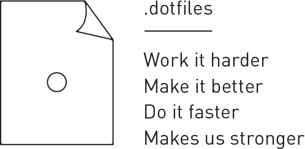

creasty's dotfiles
==================

Setup
-----

```sh
$ bash <(curl -L dotfiles.creasty.com/bootstrap)
```

And configure your secret keys:

```sh
# environment variables
$ cp zsh/secrets.zsh{.sample,}
$ vi $_

# AWS
$ cp aws/credentials{.sample,}
$ vi $_
$ ./bootstrap.d/link
```


Update
------

```sh
$ ./bootstrap
```


Extra
-----

- [Applications from Store](./docs/apps_from_store.md)
- [System Preference](./docs/system_preference.md)
- [Karabiner](./docs/karabiner.md)
- [Seil](./docs/seil.md)


Author
------

Yuki Iwanaga [@creasty](https://github.com/creasty)
