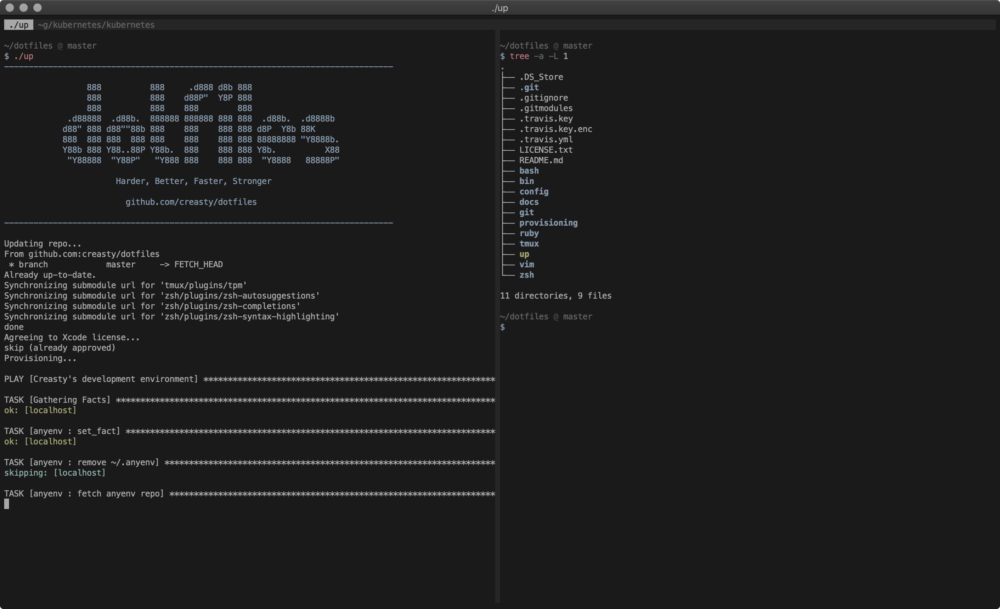
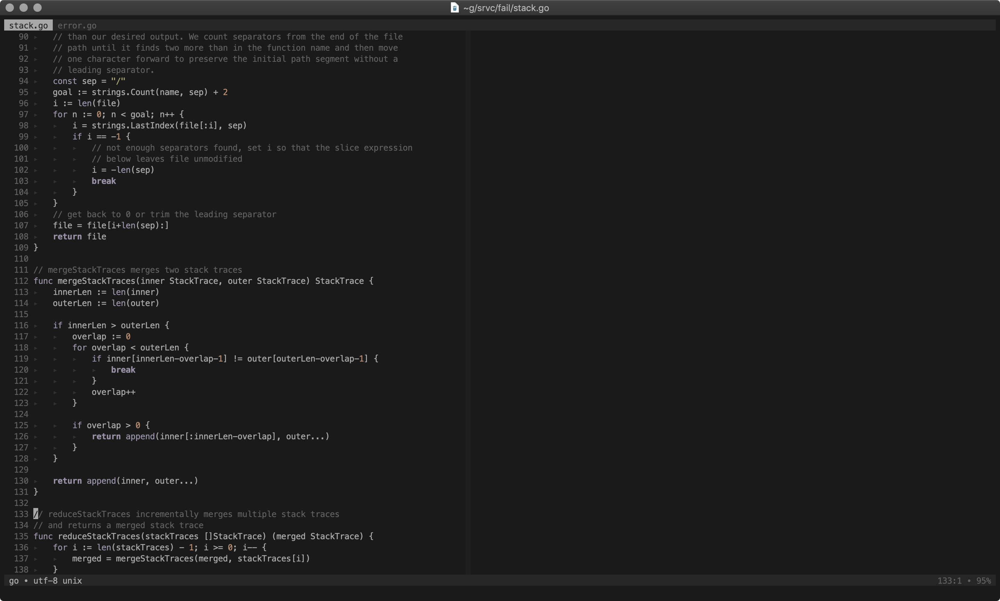

dotfiles   
========

A powerful development environment for full-stack engineers.  
Work it harder, make it better, do it faster, makes us stronger.

<pre><code>$ bash <(curl -L <a href="http://dotfiles.creasty.com/up">dotfiles.creasty.com/up</a>)</code></pre>

Screenshots
-----------

| Tmux + ZSH | Vim |
|---|---|
|  |  |

Author
------

Yuki Iwanaga (@creasty)
