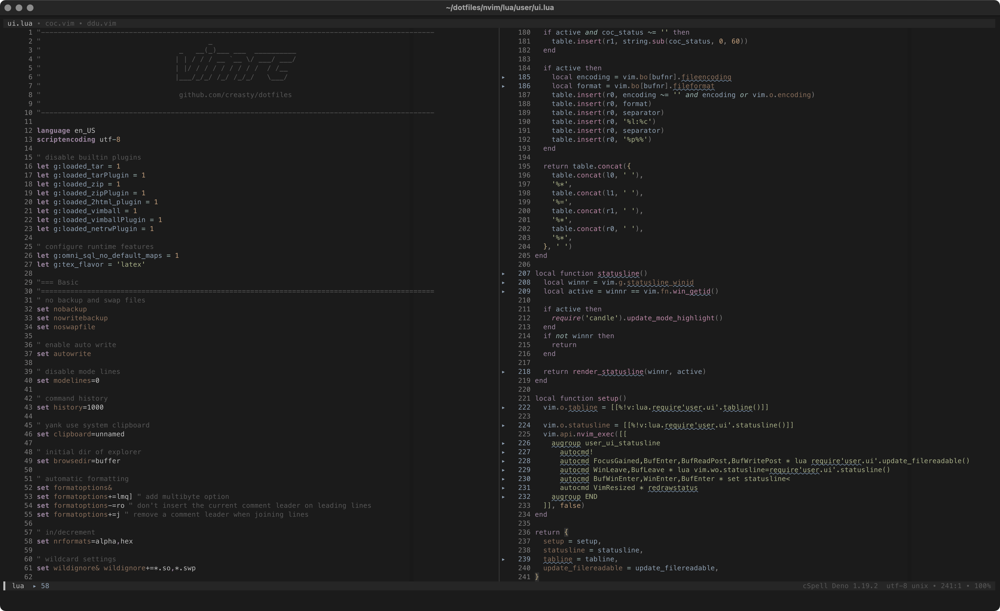
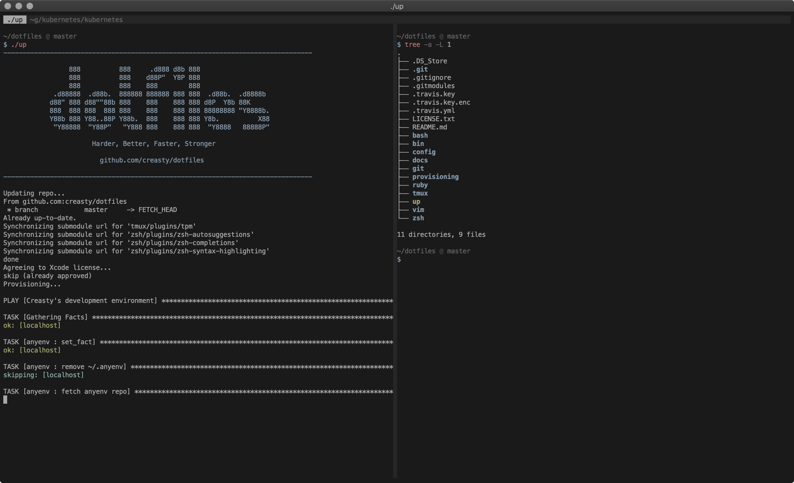

# creasty's dotfiles

[ci]: https://github.com/creasty/dotfiles/actions/workflows/provisioning.yml
[ci-badge]: https://github.com/creasty/dotfiles/actions/workflows/provisioning.yml/badge.svg
[platform-badge]: https://img.shields.io/badge/Platform-macOS-lightgrey
[license]: ./LICENSE.txt
[license-badge]: https://img.shields.io/badge/License-MIT-yellow.svg

[![Provisioning][ci-badge]][ci] ![Platform: macOS][platform-badge] [![License: MIT][license-badge]][license]

This repository contains my personal dotfiles configuration for macOS, featuring thoroughly tailored setups for NeoVim and Zsh with performance in mind.

| Neovim (Kitty) | Zsh + tmux (Alacritty) |
|---|---|
|  |  |

## Installation

<pre><code>$ curl -L <a href="https://dotfiles.creasty.com/provision">dotfiles.creasty.com/provision</a> | bash</code></pre>

It clones this repository to `~/dotfiles`, installs Homebrew and [Nix](https://determinate.systems/nix/), and applies the [nix-darwin](https://github.com/nix-darwin/nix-darwin) configuration of `flake.nix` for the current user, [home-manager](https://github.com/nix-community/home-manager) included.

To apply changes later:

```sh-session
$ sudo darwin-rebuild switch --flake ~/dotfiles#$(id -un)
```

Flakes only see files tracked by git, so `git add` a new file first.

### Links

Files are linked into the home directory by where they are in the repository, with no list to maintain:

| Repository | Home directory |
|---|---|
| `home/<path>` | `~/.<path>` (`home/aws/config` → `~/.aws/config`) |
| `config/<path>` | `~/.config/<path>` (`config/git/config` → `~/.config/git/config`) |

The Nix modules link the rest: `nvim/`, the shell files and VS Code's settings.
Links point into the checkout, so edits apply without a rebuild.

### App Store apps

Homebrew Bundle installs the App Store apps of `nix/modules/appstore.nix` with [mas](https://github.com/mas-cli/mas), which asks for your password (sudo) to install them.
mas can't sign in to the App Store, so sign in before provisioning.
`mas list` shows the IDs of installed apps, and `mas search <name>` those of others.
mas can't install iPhone and iPad apps, such as Kindle's, so get those from the App Store app.

### SSH keys

ssh signs in through [1Password's SSH agent](https://developer.1password.com/docs/ssh/), so private keys live in 1Password instead of `~/.ssh`.
Keep a host's public key in `~/.ssh/keys` and point its `IdentityFile` at it (in `~/.ssh/config.d/`) to pick the key.

## Verification

Provisioning ends by verifying its result with behavioral tests: shells are started the way terminals start them, and have to find the right runtimes, configs and commands.
To verify a machine again:

```sh-session
$ ./verify
$ ./verify --filter java  # options go to bats
```

The tests compare the machine with what the activated configuration lists in `/etc/dotfiles/manifest.json`.
Set `DOTFILES_NOVERIFY=1` to provision without verifying.

## Project structure

### Main configuration directories

- **`bin/`** : Custom executable scripts and commands (Added to system `PATH`)
- **`config/*`** : XDG-compliant configuration files (linked into `~/.config`)
- **`home/*`** : Home directory dotfiles (linked into `~` with a leading dot)
- **`nvim/`** : Neovim configurations
  - **`tests/`** : End-to-end workflow tests ([README](./nvim/tests/README.md))
- **`shell/`** : Shell environment configurations
  - **`bash/*`** : Bash-specific configurations
  - **`zsh/*`** : Zsh-specific configurations
- **`vscode/`** : VS Code settings and keybindings

### Administrative directories

- **`docs/`** : Setup documentation and resources
- **`flake.nix`**, **`nix/modules/`** : The nix-darwin configuration, a module per topic
- **`test/`** : Behavioral tests of the provisioning

## Stats

| | nvim | zsh |
|---:|---|---|
| Startup time | ~60ms | ~72ms |
| Config size | 2,900 sloc | 700 sloc |
| Original plugins | 10 plugins | 1,100 sloc of bin |
| Third-party plugins | 36 plugins | 2 plugins + 2 hooks |

### nvim

Original plugins:
- [mold.vim](https://github.com/creasty/mold.vim)
- [opfmt](https://github.com/creasty/opfmt)
- [auto_save.vim](./nvim/plugin/auto_save.vim)
- [better_tagfunc.vim](./nvim/plugin/better_tagfunc.vim)
- [blockwise_visual_insert.vim](./nvim/plugin/blockwise_visual_insert.vim)
- [emacs_cursor.vim](./nvim/plugin/emacs_cursor.vim)
- [file.vim](./nvim/plugin/file.vim)
- [next_file.vim](./nvim/plugin/next_file.vim)
- [project_dir.vim](./nvim/plugin/project_dir.vim)
- [restore_buffer.vim](./nvim/plugin/restore_buffer.vim)

Third-party plugins (excerpt):
- [coc.nvim](https://github.com/neoclide/coc.nvim)
- [copilot.vim](https://github.com/github/copilot.vim)
- [ddu.vim](https://github.com/Shougo/ddu.vim)
- [lexima.vim](https://github.com/cohama/lexima.vim)
- [nvim-treesitter](https://github.com/nvim-treesitter/nvim-treesitter)
- [ultisnips](https://github.com/SirVer/ultisnips)

<details>

```sh-session
$ hyperfine --warmup 3 --prepare 'sleep 0.1' 'nvim --headless -c quit'
$ cloc --exclude-dir=dein,template nvim
$ rg '^repo\b.+\bcreasty/' nvim/dein/*.toml
$ rg --no-heading '^\[\[plugins' nvim/dein/*.toml | wc -l
```

Profiling:

```sh-session
$ nvim --headless --startuptime /dev/stdout -c quit
```

</details>

### zsh

Third-party plugins/hooks:

- [fast-syntax-highlighting](https://github.com/zdharma-continuum/fast-syntax-highlighting)
- [zsh-autosuggestions](https://github.com/zsh-users/zsh-autosuggestions)
- [mise](https://github.com/jdx/mise)
- [direnv](https://github.com/direnv/direnv)

<details>

```sh-session
$ hyperfine --warmup 3 --prepare 'sleep 0.1' 'zsh -i -c exit'
$ cloc --exclude-dir=plugins,bash --lang-no-ext=zsh shell
$ cloc bin
$ ls shell/zsh/plugins | wc -l
```

Profiling:

```sh-session
$ ZSH_PROF_ENABLED=1 zsh -i -c exit
```

</details>

## Author

Yuki Iwanaga / [@creasty](https://github.com/creasty)
