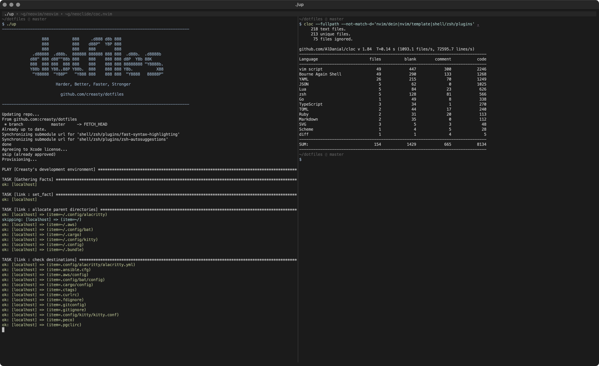

dotfiles [](https://circleci.com/gh/creasty/dotfiles)  [](./LICENSE.txt)
========

Work it harder, make it better, do it faster, makes us stronger.

<pre><code>$ curl -L <a href="http://dotfiles.creasty.com/up">dotfiles.creasty.com/up</a> | bash</code></pre>

Screenshots
-----------

| Tmux + ZSH (Alacritty) | Neovim (Kitty) |
|---|---|
|  |  |

Stats
-----

### zsh

- ~340ms to startup
- 600 loc of Zsh config
- 3 plugins

<details>

```sh-session
$ repeat 5 time zsh -i -c exit
zsh -i -c exit  0.15s user 0.16s system 98% cpu 0.319 total
zsh -i -c exit  0.17s user 0.18s system 99% cpu 0.352 total
zsh -i -c exit  0.16s user 0.17s system 100% cpu 0.335 total
zsh -i -c exit  0.16s user 0.17s system 100% cpu 0.335 total
zsh -i -c exit  0.16s user 0.17s system 99% cpu 0.335 total
```

```sh-session
$ cloc --exclude-dir=plugins shell/zsh
       6 text files.
       6 unique files.
       4 files ignored.

github.com/AlDanial/cloc v 1.84  T=0.01 s (321.4 files/s, 63158.0 lines/s)
-------------------------------------------------------------------------------
Language                     files          blank        comment           code
-------------------------------------------------------------------------------
zsh                              4            127             92            567
-------------------------------------------------------------------------------
SUM:                             4            127             92            567
-------------------------------------------------------------------------------
```

```sh-session
$ ls shell/zsh/plugins | wc -l
       3
```

Profiling:

```sh-session
$ ZSH_PROF_ENABLED=1 zsh -i -c exit
```

</details>

### nvim/vim

- ~340ms to startup
- 3000 loc of VimScript config
- 47 plugins (extra 79k loc of VimScript & 36k of other various languages)

<details>

```sh-session
$ repeat 5 time nvim --headless -c quit
nvim --headless -c quit  0.31s user 0.08s system 113% cpu 0.351 total
nvim --headless -c quit  0.31s user 0.09s system 114% cpu 0.340 total
nvim --headless -c quit  0.31s user 0.08s system 114% cpu 0.339 total
nvim --headless -c quit  0.30s user 0.08s system 115% cpu 0.331 total
nvim --headless -c quit  0.30s user 0.08s system 114% cpu 0.334 total
```

```sh-session
$ cloc --exclude-dir=dein vim
     144 text files.
     139 unique files.
      57 files ignored.

github.com/AlDanial/cloc v 1.84  T=0.09 s (1018.7 files/s, 60278.0 lines/s)
--------------------------------------------------------------------------------
Language                      files          blank        comment           code
--------------------------------------------------------------------------------
vim script                       64            701            599           3086
JSON                              1              8              0            257
Python                            2             36              2            192
TOML                              2             45             16            155
Ruby                              8             17              0            113
C                                 2             14              6             59
Go                                2             11              0             29
C/C++ Header                      1              3              0             12
HTML                              1              0              0             10
GraphQL                           3              0              0              9
make                              1              4              0              9
Java                              1              1              3              8
Markdown                          1              3              0              7
C++                               1              2              5              7
Bourne Again Shell                1              3              0              7
TypeScript                        1              1              0              4
--------------------------------------------------------------------------------
SUM:                             92            849            631           3964
--------------------------------------------------------------------------------
```

```sh-session
$ ag '^\[\[plugins' vim/dein.toml vim/dein_lazy.toml | wc -l
      47
```

</details>

Author
------

Yuki Iwanaga ([@creasty](https://github.com/creasty))
