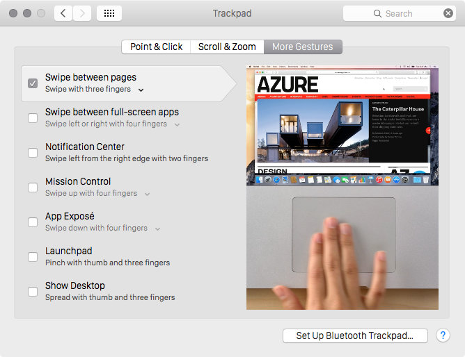

dotfiles
========

Installation
------------

```sh
$ bash <(curl -L dotfiles.creasty.com/bootstrap)
```

or to update already bootstrapped computer:

```sh
$ ./bootstrap
```


Applications via AppStore
-------------------------

- 1Password
- Airmail
- ColorChooser
- Dash
- Equation Maker
- Evernote
- ForkLift
- Growl
- Keynote
- Notefile
- Numbers
- Pages
- Paw
- Pocket
- Slack
- SnapRuler
- Texpad
- The Unarchiver
- Wunderlist
- iPhoto


Extra configurations
--------------------

### Security key settings

1. Create `_zsh/secrets.zsh`.
2. Configure aws cli by run: `$ aws configure`

### System Preference.app

#### Keyboard

1. Change modifier keys (press `Modifier Keys...` button in `Keyboard` tab)  
  
2. Set key for moving focus to next window (in `Keyboard` section of `Shortcuts` tab)  
  
3. Enable full keyboard access (in `Shortcuts` tab)  
  

#### Trackpad




### Karabiner.app

1. Enable these options (in `Change Key` tab)  
  
2. Set these values (in `Key Repeate` tab)  
  
3. Turn off status message (in `Status Message` tab)  
  
4. Hide icon in the menu bar (in `MenuBar` tab)  
  

### Seil.app

Change `Control_L` to `Escape` in `Other keys` section of `Setting` tab.  


Author
------

Yuki Iwanaga [@creasty](https://github.com/creasty)
