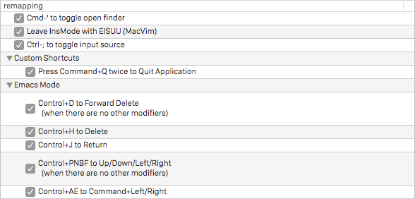
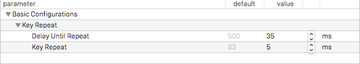

Karabiner.app
=============

1. Enable these options (in `Change Key` tab)  
  
2. Set these values (in `Key Repeate` tab)  
  
3. Turn off status message (in `Status Message` tab)  
  
4. Hide icon in the menu bar (in `MenuBar` tab)  
  
